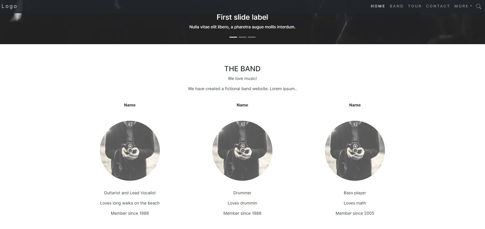

# Projeto
Este é um projeto feito em React com Next, onde foi desenvolvido o site The Band do bootstrap que pode ser encontrado [aqui.](https://www.w3schools.com/bootstrap/bootstrap_theme_band.asp) 

Foi utilizado a lib de [icones do boostrap](https://www.npmjs.com/package/react-bootstrap-icons) e o [boostatrap](https://react-bootstrap.netlify.app/) para fazer os layouts.

## Site


## Getting Started

First, run the development server:

```bash
npm i
npm run dev
